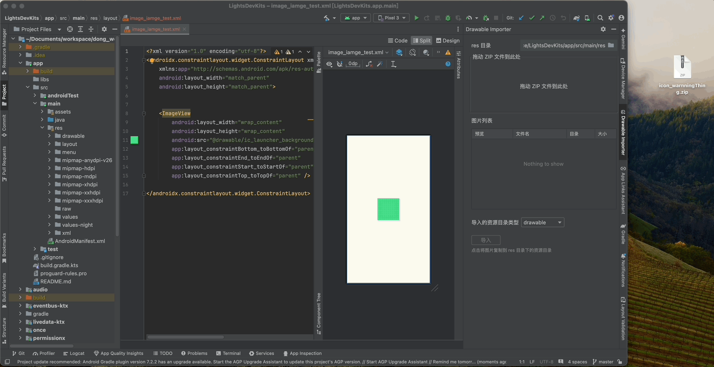

# Android Drawable Importer

A simple and efficient Android Studio / IntelliJ IDEA plugin for batch importing Android drawable resources.

English | [中文](README_cn.md)

---

## Features

- ✅ **Batch Import** - Import multiple density drawable resources at once
- ✅ **Drag & Drop** - Simply drag and drop your ZIP file
- ✅ **Image Preview** - Preview all images before importing
- ✅ **Conflict Detection** - Automatically detect and handle file conflicts
- ✅ **Rename Support** - Rename single image during import
- ✅ **Flexible Target** - Choose between drawable or mipmap directories

## Usage

Find and open the **"Drawable Importer"** tool window from the right sidebar in Android Studio or IntelliJ IDEA.

## Installation

### Method 1: Install from JetBrains Marketplace (Recommended)

1. Open Android Studio / IntelliJ IDEA
2. Go to `Settings/Preferences` → `Plugins`
3. Search for "Android Drawable Importer"
4. Click `Install`

### Method 2: Manual Installation

1. Download the latest [Release](https://github.com/yndongyong/AndroidDrawableImporter/releases)
2. Open Android Studio / IntelliJ IDEA
3. Go to `Settings/Preferences` → `Plugins`
4. Click the gear icon ⚙️ → `Install Plugin from Disk...`
5. Select the downloaded ZIP file and install

## Requirements

- Android Studio Narwhal (2025.1.3) or higher
- IntelliJ IDEA 2021.1 or higher (with Android plugin installed)

## FAQ

**Q: Why is there no response after dragging the ZIP file?**  
A: Please ensure the ZIP file directory structure meets the requirements and must contain folders in `drawable-xxx` or `mipmap-xxx` format.

**Q: What image formats are supported?**  
A: Currently supports png, jpg, jpeg, webp formats.

**Q: Can I import a single image?**  
A: Yes, package the single image into a ZIP file according to the directory structure above. Single image import also supports renaming.

## Changelog

See [CHANGELOG.md](CHANGELOG.md) for version history.

## License

This project is licensed under the MIT License - see the [LICENSE](LICENSE) file for details.

## Author

**yndongyong**
- Email: yndongyong@gmail.com
- Website: https://yndongyong.github.io
